# Django CRM - Container Orchestration Final Assignment
## Project Report

---

## Step 1: Gitea Repository Setup

### Tasks Completed:
- Cloned repository to Gitea: `https://gitea.devsecmindset.dev/Richard/final-assignment-crm.git`
- Added teammates as collaborators
- Repository configured with proper access

### Screenshots:
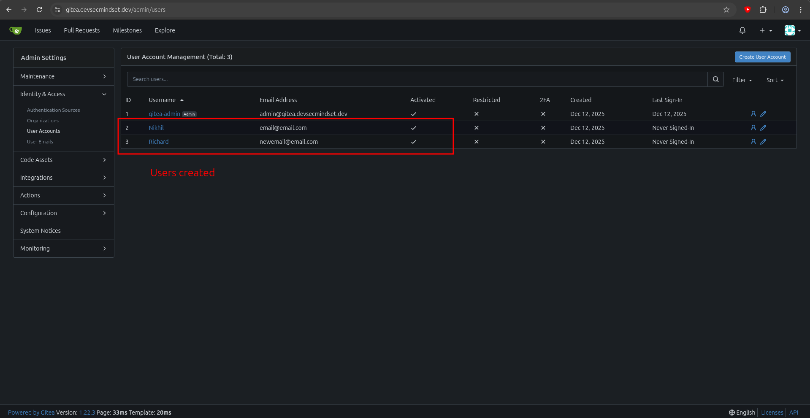
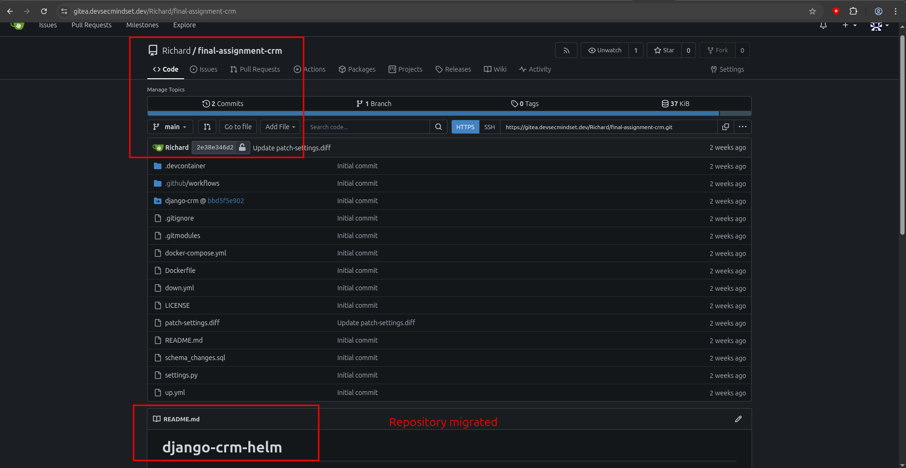
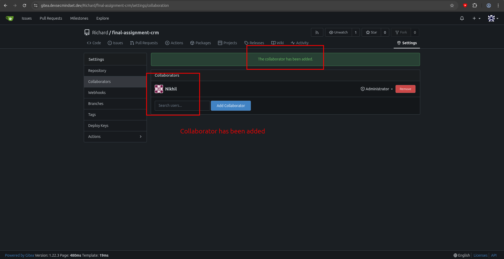

---

## Step 2: NFS Storage Configuration

### Tasks Completed:
- Configured TrueNAS NFS storage for database persistence
- Created StorageClass: `truenas-nfs`
- Verified NFS mount accessibility
- Database PVCs created and bound

### Screenshots:
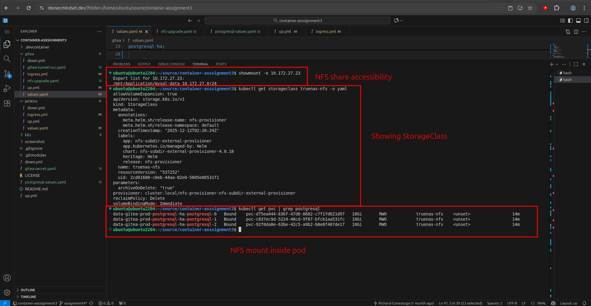
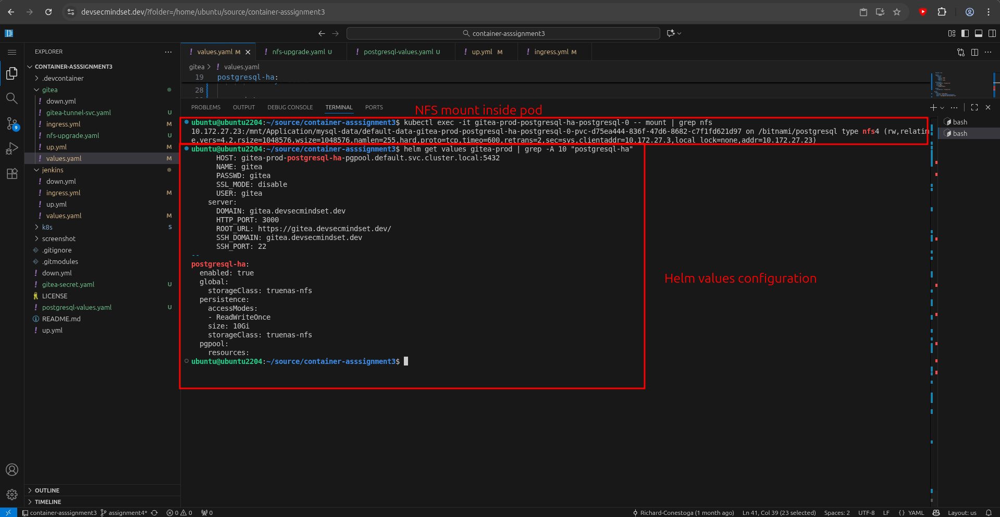
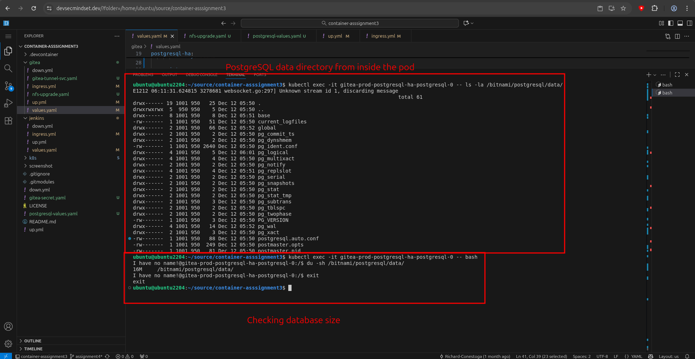
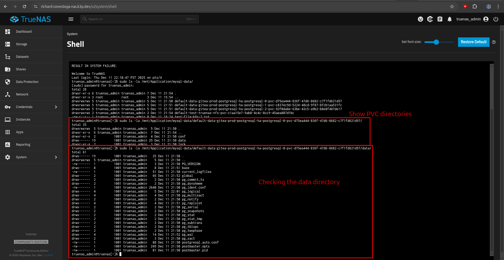

---

## Step 3: CI/CD Pipeline with Gitea Actions

### Tasks Completed:
- Created Gitea personal access token with package write permissions
- Set up Gitea Actions runner using Docker
- Created `.gitea/workflows/build-and-push.yml` workflow file
- Configured automated Docker image build on code push
- Configured automated push to Gitea container registry
- Fixed Dockerfile to include g++ compiler for numpy dependencies
- Successfully built and pushed image to `gitea.devsecmindset.dev/nikhil/final-assignment-crm`

### Runner Setup Process:
1. Generated Gitea token with `write:package` permission
2. Added token as repository secret (`GITEATOKEN`)
3. Created runner registration token from repository settings
4. Deployed runner using Docker:
   ```bash
   docker run -d --name gitea-runner \
     -e GITEA_INSTANCE_URL=https://gitea.devsecmindset.dev \
     -e GITEA_RUNNER_REGISTRATION_TOKEN=<token> \
     -v /var/run/docker.sock:/var/run/docker.sock \
     gitea/act_runner:latest
   ```
5. Verified runner registered and active in repository settings

### Screenshots:
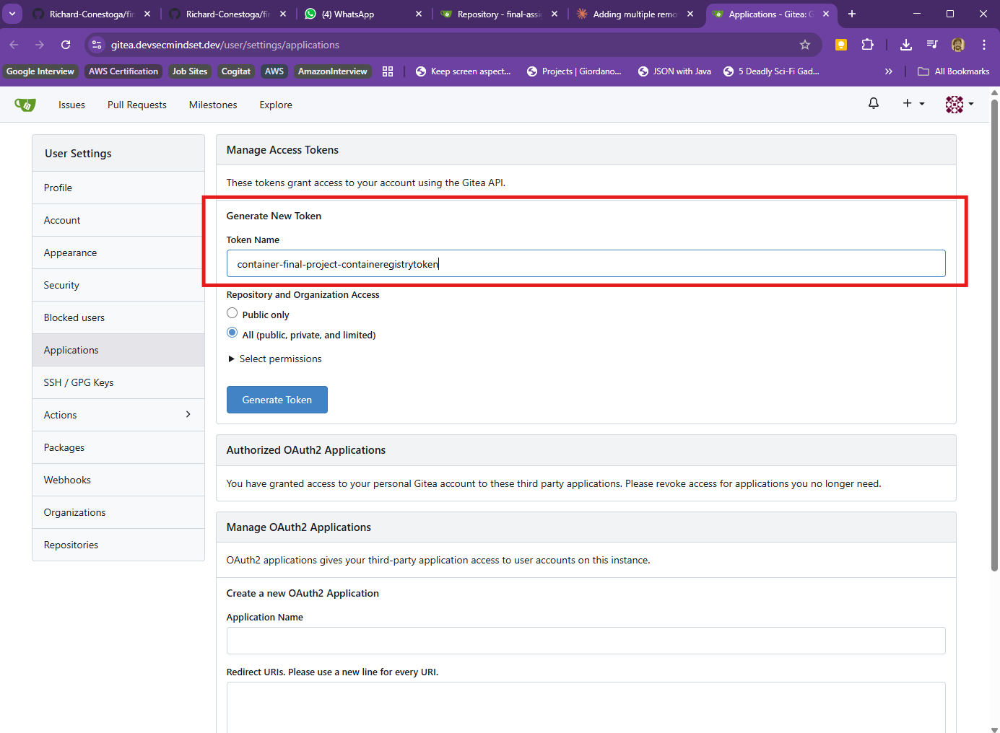
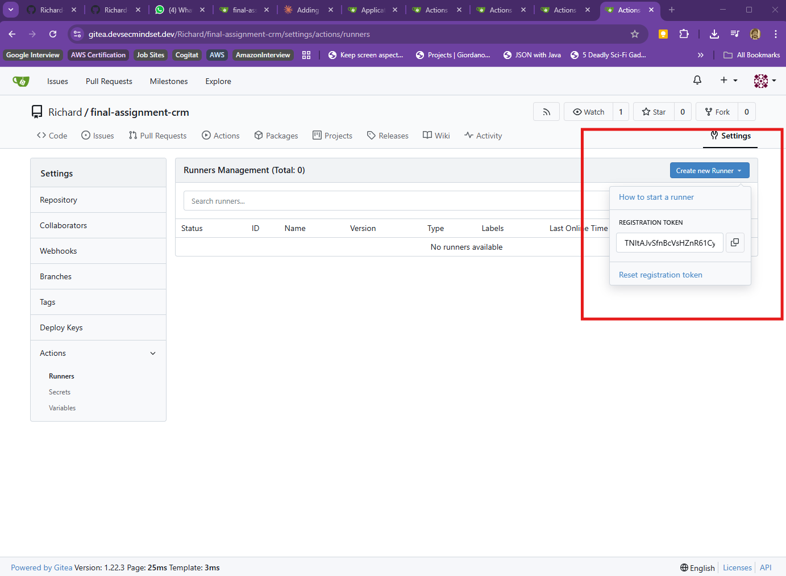
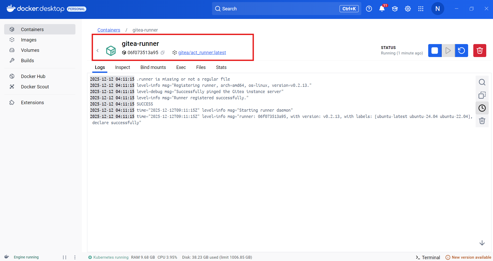
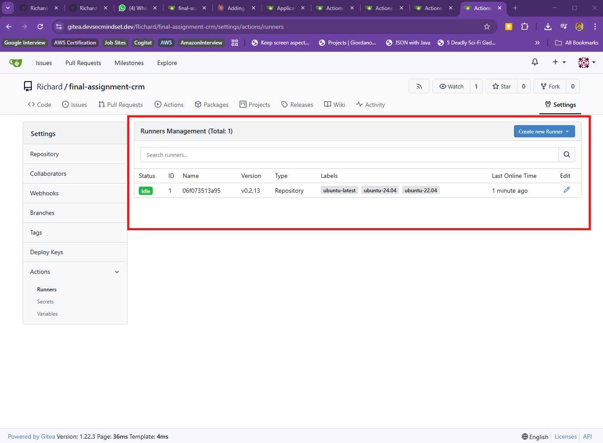
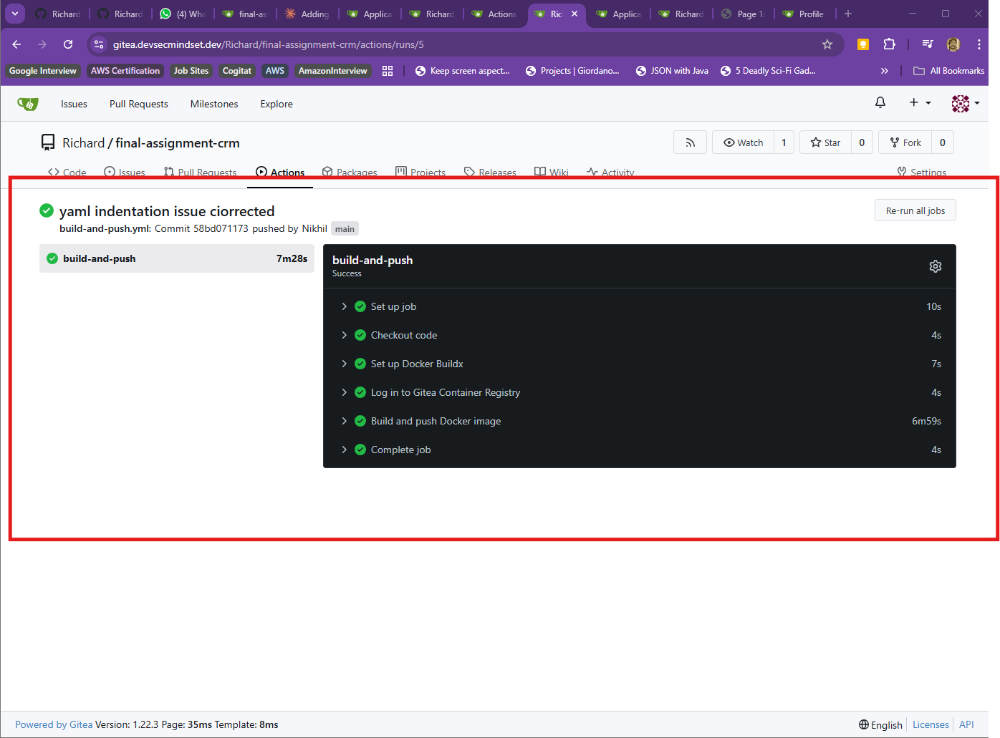
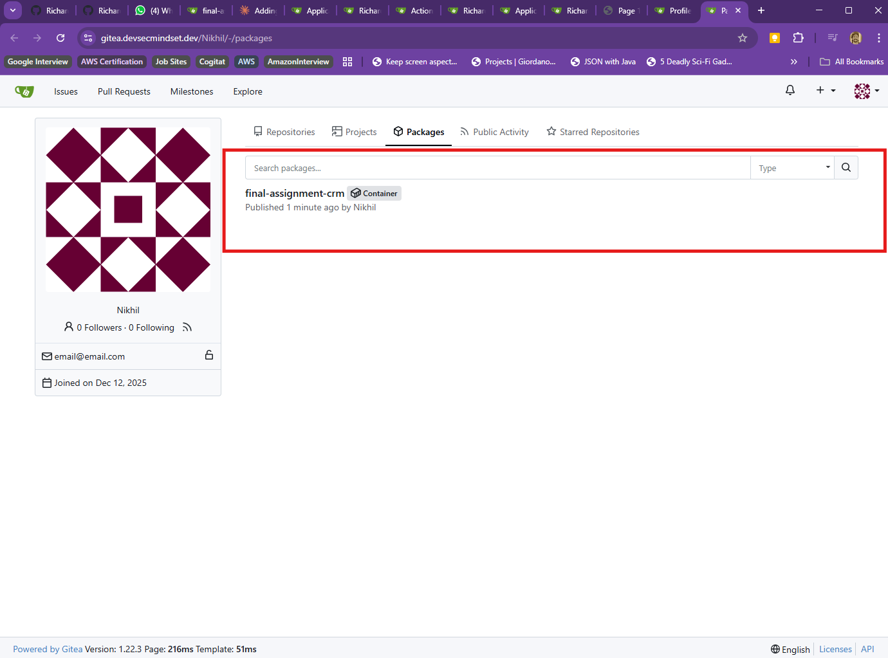
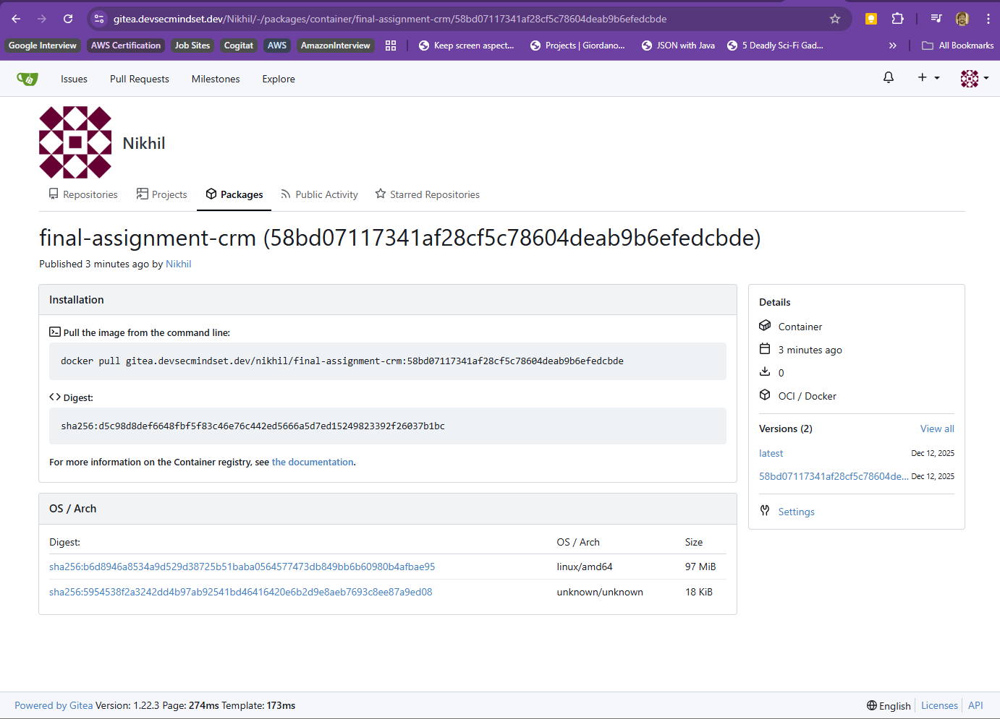

---

## Step 5: Kubernetes Deployment with Helm

### Tasks Completed:
- Updated docker-compose.yml to use Gitea registry image (`gitea.devsecmindset.dev/nikhil/final-assignment-crm:latest`)
- Installed Kompose tool
- Converted docker-compose.yml to Kubernetes manifests using Kompose
- Fixed Kubernetes resource naming (replaced underscores with hyphens for DNS compliance)
- Created Helm chart structure with Chart.yaml and values.yaml
- Organized Kompose-generated manifests into `crm-helm-chart/templates/`
- Modified up.yaml to use Helm for Kubernetes deployment
- Modified down.yaml to use Helm for Kubernetes cleanup
- Installed Helm on local machine
- Successfully deployed application to Kubernetes cluster using `helm install crm-app ./crm-helm-chart`

### Deployment Status:
- Database (MySQL) pod: Running
- Adminer pod: Running
- CRM application pod: Deployed (requires image rebuild with runtime dependencies)

### Screenshots:
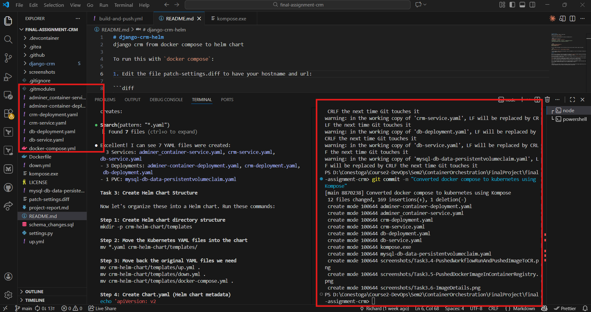
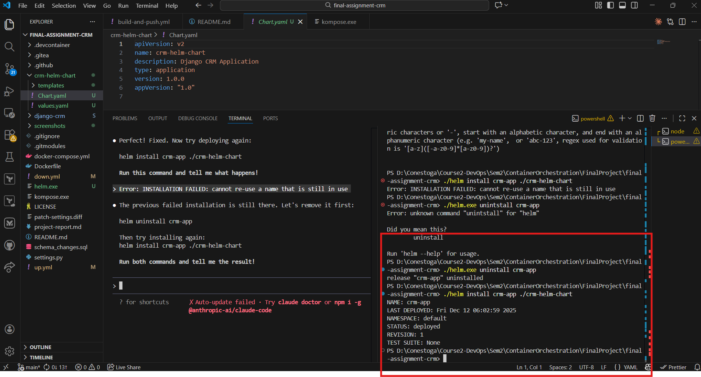
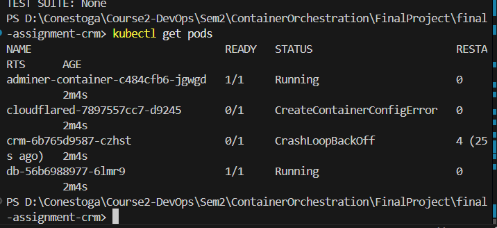

---

## Project URLs

- **Gitea Repository**: https://gitea.devsecmindset.dev/Richard/final-assignment-crm.git
- **Public GitHub**: https://github.com/Richard-Conestoga/container-asssignment3.git
- **Gitea Instance**: https://gitea.devsecmindset.dev/
- **Container Registry**: https://gitea.devsecmindset.dev/Nikhil/-/packages/container/final-assignment-crm

---

## Technologies Used

- Docker & Docker Compose
- Kubernetes (K3s)
- Helm
- Kompose
- Gitea & Gitea Actions
- Gitea Container Registry
- TrueNAS (NFS Storage)
- Django CRM Application
- MySQL Database
- Adminer (Database Management)

---

## Team Contributions

### Partner (Richard):
- Step 1: Gitea Repository Setup
- Step 2: NFS Storage Configuration

### My Contribution (Nikhil):
- Step 3: CI/CD Pipeline with Gitea Actions
- Step 5: Kubernetes Deployment with Helm
